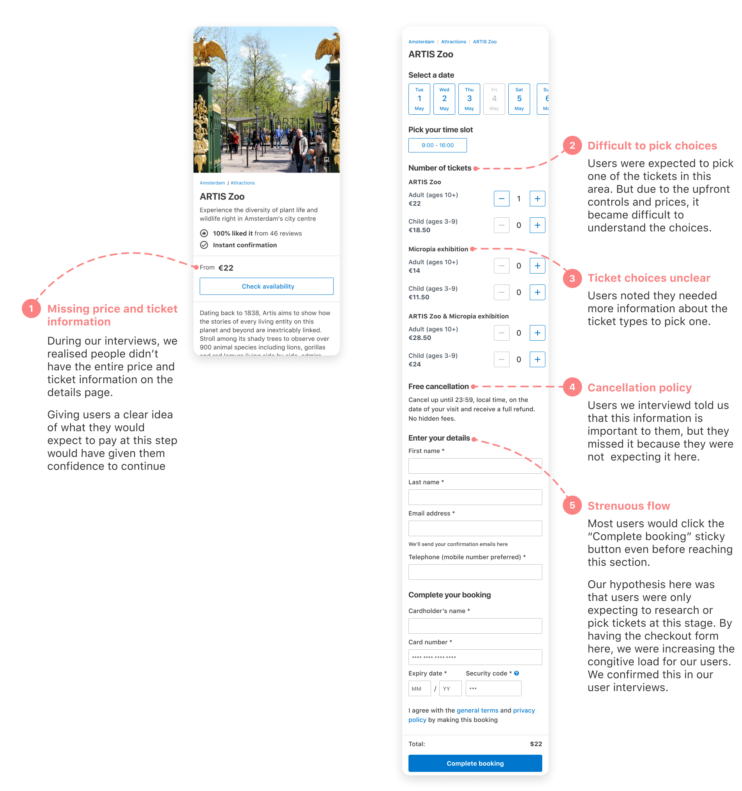
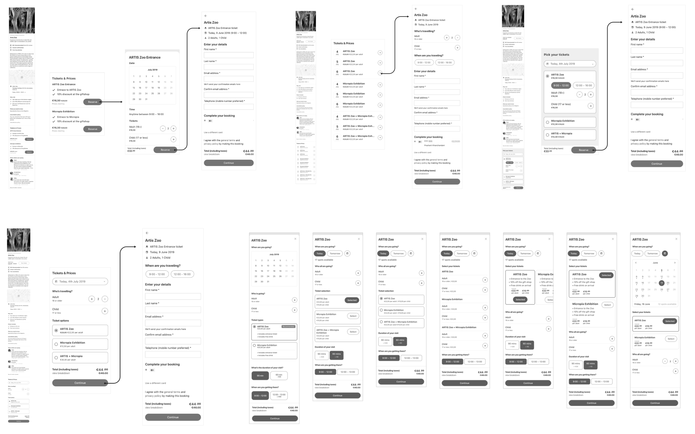
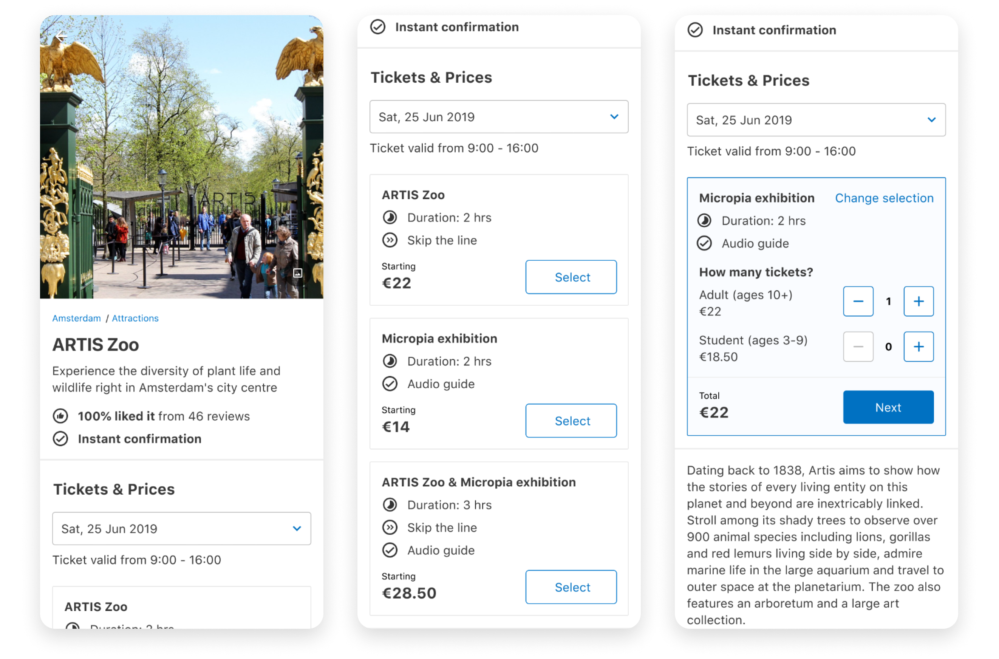
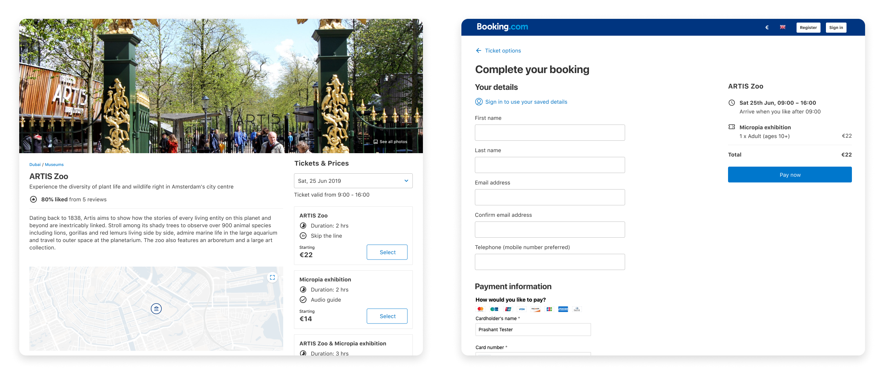

## About

I worked on this project as the UX designer in Booking.com’s Attractions team. This product helps people book tours and activities while on their trips. This project was a redesign of the checkout experience on the desktop web, mobile web, and the Booking.com apps through web views. I was involved in UX design, user research, prototyping, quantitative analysis and A/B testing.

I was the only designer in a team of a copywriter, four developers, a researcher and a project manager. This redesign fixed some of the significant issues with our checkout flow. With Attractions moving from an MVP to a real product, we needed a scalable solution for our growing business.

## Research

We knew that the checkout flow had some fundamental usability issues. To understand these problems better, me and Yaniv (the senior researcher working in our team) did some usability studies and quantitative analysis. We found a myriad of problems that we needed to solve. Here are the most critical issues we wanted to tackle:

## Solution Exploration

It was clear that we would have the most significant impact if we change how users pick their dates, times and tickets. The date, time and ticket selection was on the top of the checkout flow. It was one of the more confusing parts that we needed to fix.

I started exploring different ways in which users can pick their dates, times and tickets. A few hours of sketching and prototyping on Figma led me to a few ideas I could already get feedback on:

## Usability Tests
Next, I did some usability tests on the best of my prototypes. I compared two different approaches:

- First, I tried splitting the flow into three different steps (attraction details, ticket selection and book page). This approach made sure the cognitive load on each page was minimal.

- The other approach involved moving the ticket selection as part of the content on the details page. This change helped users view tickets and prices upfront while reading about the attraction.

I also conducted the same user test with the existing design as a control to make sure that we were in-fact solving the problems we set out to tackle.

## A/B Tests
Before this change, we saw a large number of validation errors on the first checkout step. Our hypothesis was that users would go to the checkout step to view the final price, when trying to compare different similar attractions.

To test this out, we split the flow into two steps; ticket selection and checkout. Users would get a clear idea of the price in the ticket selection step, and would checkout only when they actually want to book. If we were correct, we would see users users with higher intent to book enter the checkout page.

This is exactly what we saw. The validation errors and bounce rate of the checkout page reduced, with no measurable change in conversion. Which means, fewer people were lost or encountering errors when booking their attraction.

## Final Product
Our final solution made the flow simpler, reduced validation errors and highlighted ticket types and prices higher up in the funnel. Users were able to compare different attraction types without having to hop between pages.

The solution scaled to handle 3x growth in inventory. It gracefully handled all the different types of attractions added to the platform since, from museum visits, to boat tours, to cooking classes. This solution has proven to be durable, it still stands unchanged on the product today (4 years after being built).