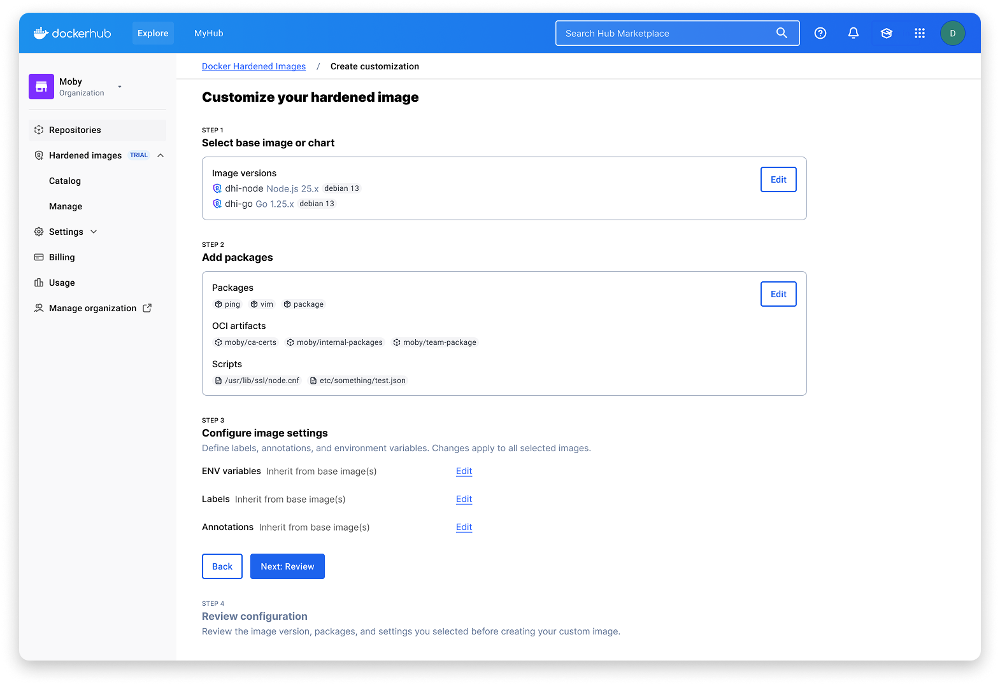
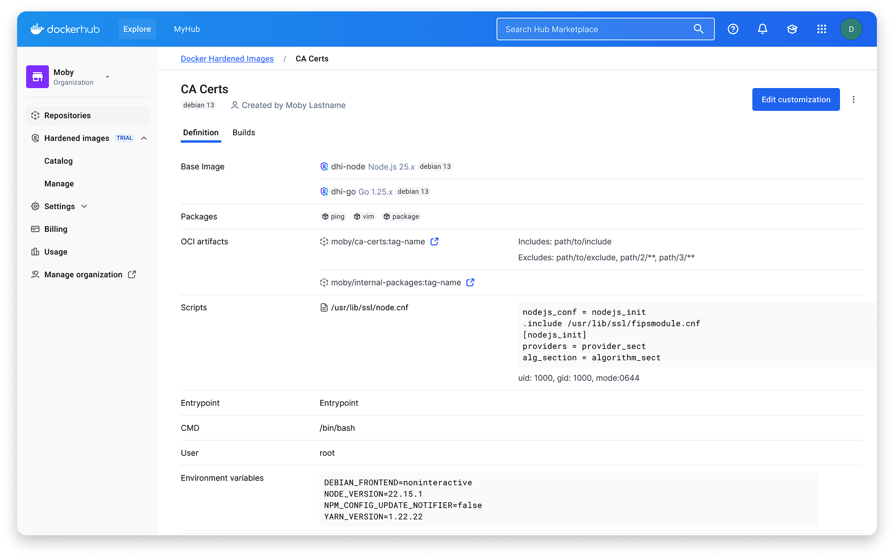
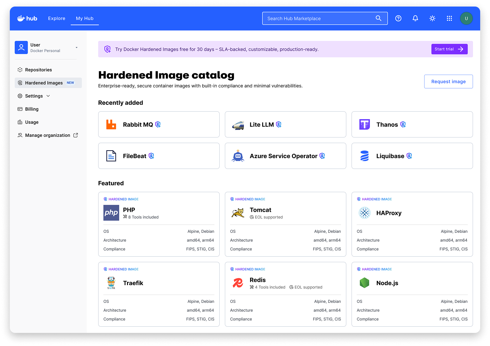
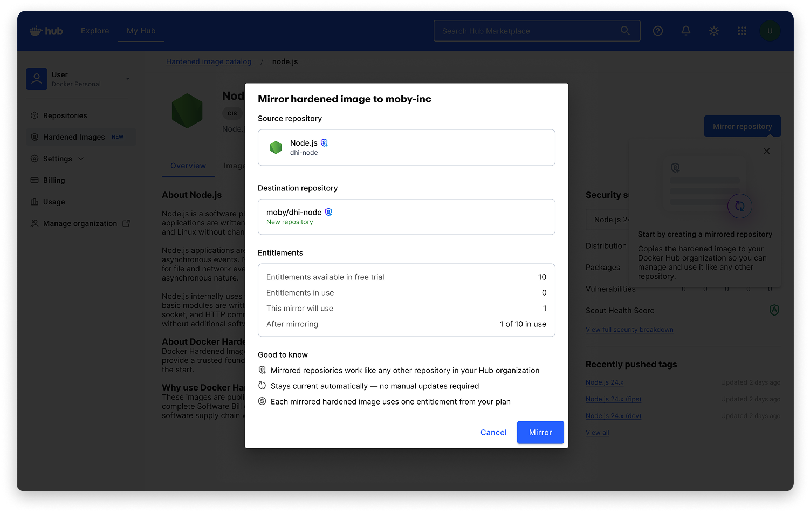
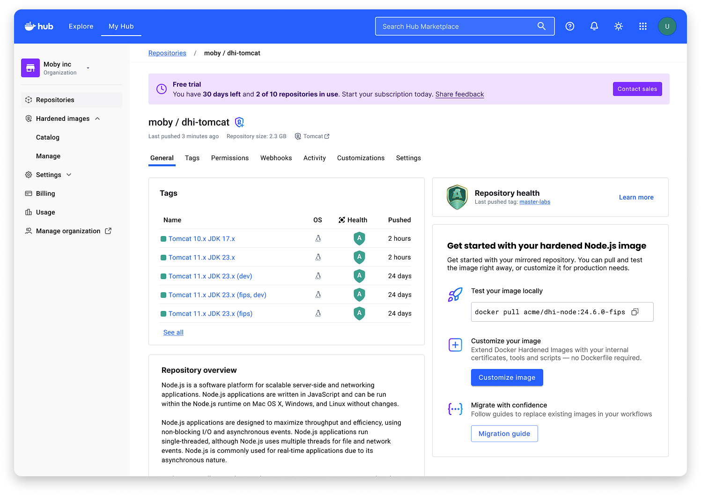

## Context
Supply chain attacks were projected to cost businesses $60 billion globally in 2025. Docker Hardened Images (DHI) was Docker's answer: a catalogue of minimal, near-zero-CVE images with SBOMs, provenance, SLSA Build Level 3, and continuous vulnerability patching.

I joined the team right as DHI was being launched as a paid product. I co-led the designs with another designer, Sean. We split our work based on initiatives. I owned and shipped the first version of Customisations (DHI's single most requested feature), the public catalogue, and free-trial flows that unlocked self-serve access, all under high executive timeline pressure.

## Customisations
Our first enterprise users wanted to use DHI but were having to work around the default images. They wanted to customise images by adding their own CA certificates, custom packages, or set environment variables. Customers were excited about DHI in principle, but couldn't use it without being able to customise their images. This was a huge revenue block for the business and a top priority.

I worked with the product and engineering team at Docker to design a customisations model that worked for us. This involved getting into deeply technical discussions about how customisations work. The solution needed to serve the expert security engineer, while being unobtrusive to the developer using the image.

## DHI Self Serve
The directive was clear; we had to ship DHI self-serve in 20 days. We wanted a clean, focused experience so developers can quickly go from _"I just heard about DHI"_ to _"I'm running my first hardened image"_. I closed design within a week. The changes were shipped in 20 days.

We launched with a public DHI catalogue, a 1-click trial activation experience, and a basic guided setup flow to get developers started. We prioritised ruthlessly, and anything that didn't help the first _"try it"_ experience was moved to fast-follow.

 

## Takeaways
My usual instinct is to go _"back to first principles"_, but in this situation, velocity was the design value. The team needed hands on deck, and I needed to be up and running as soon as possible. I'm glad I did, because you earn the right to push back on inherited decisions by first being useful inside them.
