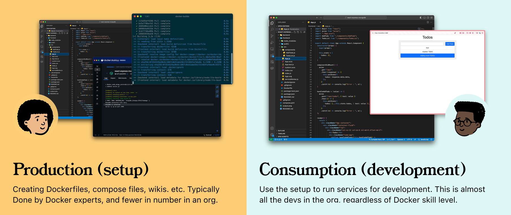
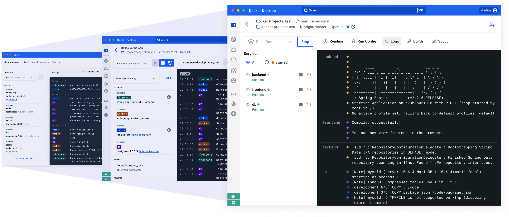
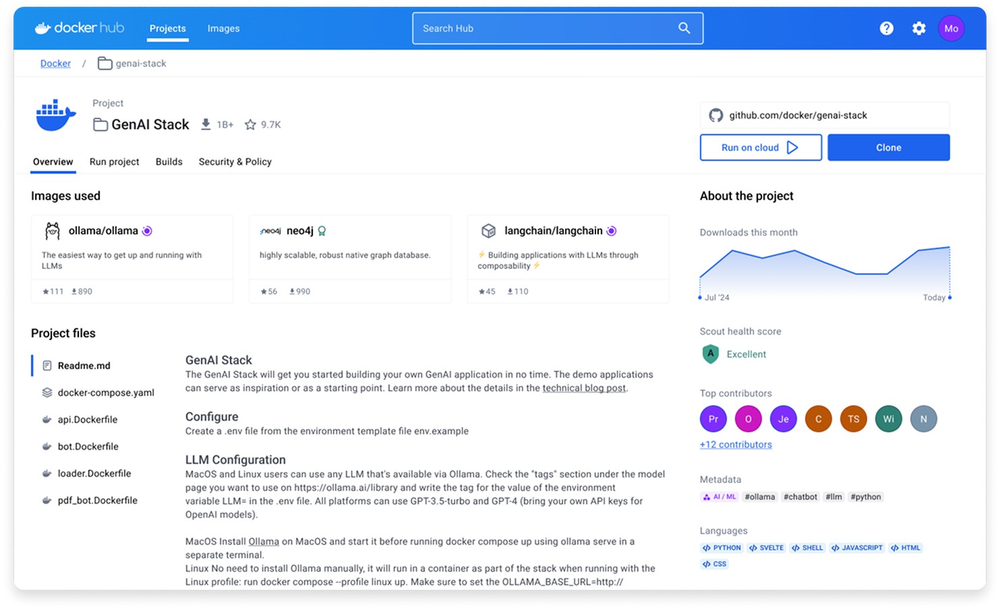
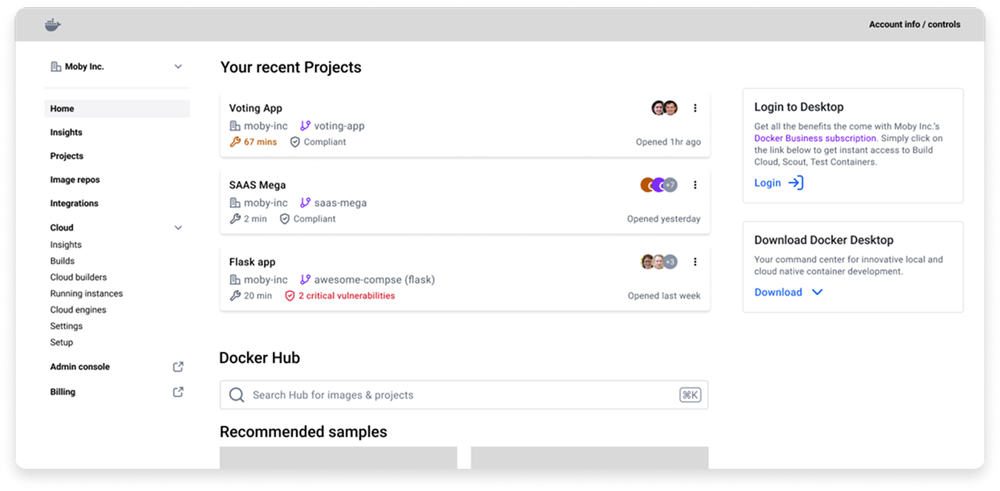
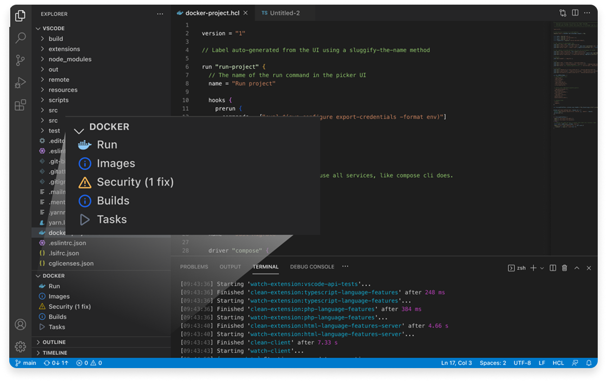
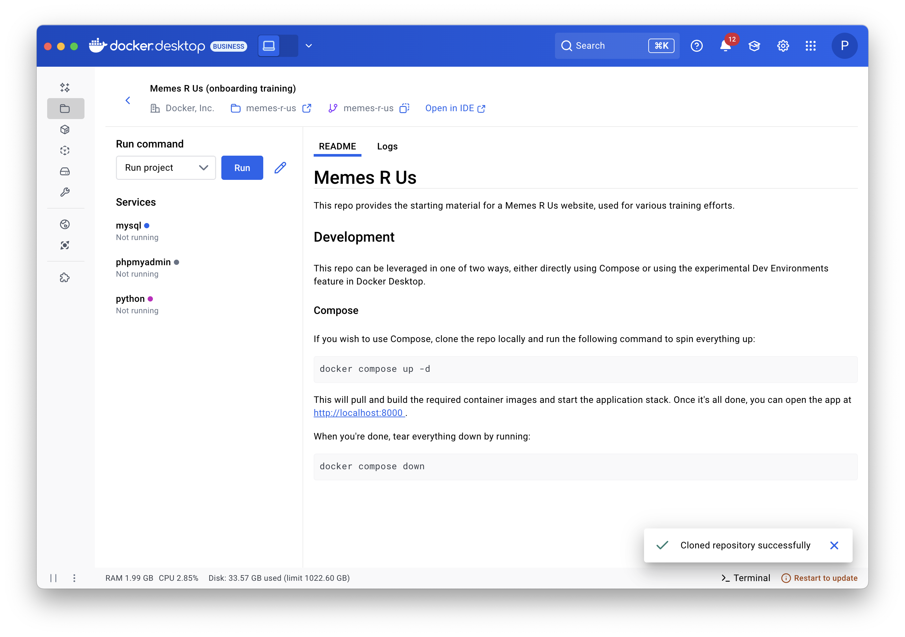
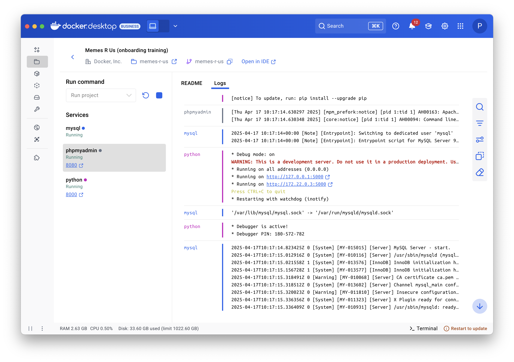

## Context
Docker is an open source project that helps deliver software in packages called containers. Most of our product suite is built on top of the core Docker primitives of containers and images. We learnt this did not match the developers' mental model, who thought in terms of projects, services, and git repositories. As Docker's product suite grew, we saw other teams develop similar but different constructs to group Docker primitives. Docker Projects was a strategic initiative to bridge the gap between developers' mental models and Docker's container-centric approach, creating a unified project-based workflow. 

I was the lead designer for this initiative; I worked with a PM, and four engineers to build the MVP that was tested with 32 Early Access users. The initiative successfully validated strong user engagement and value but was discontinued to focus on Docker Hardened Images (DHI), and Docker's AI initiatives.

## Goals
The exploratory interviews I ran showed us that Docker had two kinds of developers, and they interacted with Docker very differently. 

First, the Producers, who wrote Dockerfiles, understood the Docker primitives, and were motivated to build secure, optimised images.

Second, the Consumers, who used what Producers built, and just wanted to run the app so they could develop against it. They cared about a reliable environment, easily accessible controls, and clear logs. Most developers in a team were Consumers, and this was a highly under-served base.

The main goals of this project were to create a Docker experience that:
- Leverages the developer’s **mental model** and consumption workflows (focuses on “apps” and “services” over “images” and “containers”)
- Enables developers in teams to **learn Docker while using it**
- Helps connect the dots in the current and future **Docker product suite.**

## Process
Once the Producer/Consumer framing landed, the flows stopped being feature-named and started being persona-named. We had weekly feedback sessions with the engineers where they argued about that person's experience, not a ticket number. This was in turn a great input for subsequent design iterations and research calls. The design process I set up in this team is still something I'm proud of. We had weekly design reviews on Wednesdays, and 1-on-1 research calls with external users on Fridays. This made sure we were learning and iterating fast.

The screenshot above shows how I iterated on the service information and logs UI.

## The Platform
Beyond the individual developer workflows, one of our main goals was to build a unified experience that connects all the current and future Docker products. This involved spending time with the individual product teams, understanding their goals and needs and incorporating them in the definition of the product we were building. We made countless mockups to align all of Docker's surfaces, including Docker Desktop, Docker Hub, the CLI, and possible future surfaces, the CLI plugin, etc. One of the most useful exercises during this work was a "pre-mortem" that I ran with the entire design team. It helped us spend time considering all the ways in which we could fail, and helped us be thorough with our solution. 

## Early access
Projects was released in Early Access to all Docker employees, and 32 external developers at different experience levels with Docker. We had bi-weekly check-ins with all external developers in order to understand how Projects landed with them. We produced over 28 hours of recorded research calls, with quotes like "Docker Projects has the potential to become a go-to tool in the developer toolkit" and "It cuts my time by... probably by 20 minutes... because I don't have to create the image". The Producer/Consumer framing was very close to the language an actual customer used to describe why the product was useful to them.

In terms of numbers, over the course of 6 weeks, we saw 94% Week 1 engagement, dropping to 74% final week, and a 92% task completion success rate.

## Release ready
We were release ready when the project was discontinued to focus on other initiatives. We cleaned up the work and documented what we learnt to share with any team that may look at this work in the future. We did have Docker developers comment on how they would miss the solution, since they were actively using it in their workflows.

>*"... I primarily use Docker Projects to run my application stacks now."* 

## Takeaways
This project really stretched my role as a designer. I had to jump from broad architecture decisions to fine-grained technical details within the same hour. A lot of the research work I did, and the definitions of the Producer / Consumer personas became the common communication tools within the org. A few things I learnt along the way:
- **If you aren't ruthlessly prioritising, you aren't moving fast enough.** There were instances when we had to pick between two features that we were confident about, and decided to build the feature that we would learn the most from.
- **A good product is a lagging metric of a healthy team.** In the early days, we spent time aligning and collaborating on the solution. The design goals and values helped here. It meant that when something went wrong, or if we needed to cut features, we all knew what the right thing to do was. 
- **Developers don't want to be spoon-fed.** This was very clear right from the start and was one of the core values of the team. It could have been very easy to hide away complexity and make things "cleaner" in the UI, but that would make the solution incomplete. More experienced developers appreciated having all the information, and controls exposed using progressive disclosure.