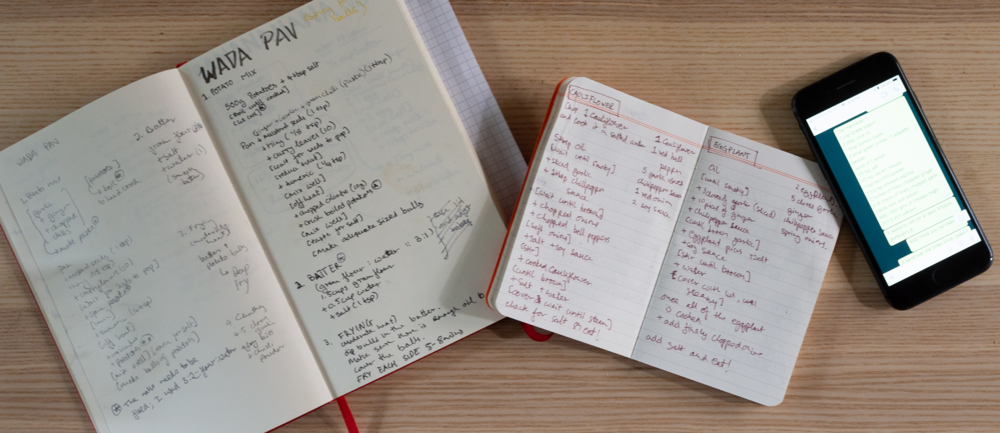
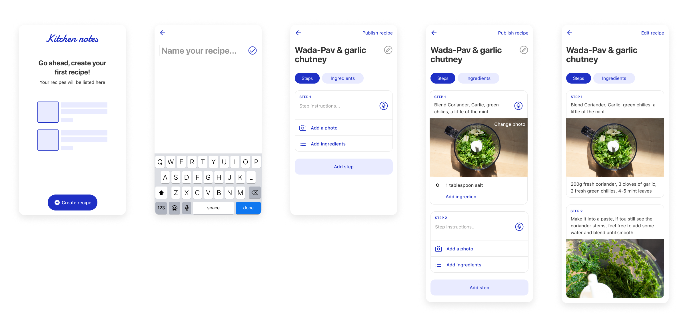

## About

Kitchen notes is a personal project that originated from a problem I was facing in the kitchen. I spend a lot of time learning new recipes and iterating on the ones that I like. I usually write my recipes on paper. I wanted to build a tool that helps me save recipes while I cook. I also wanted an easy way to read and share recipes with others. 

## The Problem

Throughout the ideation process, I identified the problems I wanted to solve with this project. During this time, I wrote down my own experiences with documenting and sharing recipes and asked friends and family about their problems with the same. Here are the issues I set out to solve:

- Recording and updating recipes: Writing down recipes while cooking can be a messy situation. Usually, you have your hands busy and multiple time-sensitive tasks to complete. If you pick to write down instructions later, there is a high chance that you forget ingredients or entire steps. I also wanted an easy way to document texture and colour, which are two essential aspects of cooking.

- Sharing recipes: I sometimes get asked for recipes. I’ve sent people links, images from my notes and even long WhatsApp messages. I believe that if home cooks could digitise their work, it would help them share recipes easily.

## Explorations

After my initial research and competitive analysis, it was clear that the meat of the problem was the recipe creation flow. I had to design a recipe creation process that was simple, clear and efficient at saving every possible detail.

Once I had a clear idea of the functionality and experience needed, I started making some mockups of the recipe creation flow. Soon after that I built the first version of the app to test out. Since I didn’t have access to users or co-workers to test with, I did a few feedback sessions with Friends and Family. The app was beneficial for highlighting problems that I missed with the static mockups (like typing with wet hands). After a few rounds of testing the app, I went back to Figma with a list of critical issues that needed fixing.

## Prototype

The flow highlighted below is the next version of the app. This was a fun exploratory exercise. I learnt the advantage of having a functional prototype early in the product development process.
