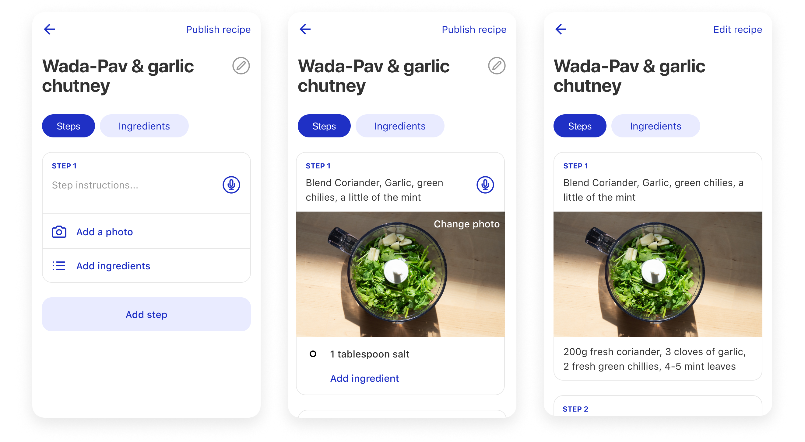

## Background

Kitchen notes is a personal project that originated from a problem I was facing in the kitchen. I spend a lot of time learning new recipes and iterating on the ones that I like. I usually write my recipes on paper. I wanted to build a tool that helps me save recipes while I cook. I also wanted an easy way to read and share recipes with others. 

## Identifying the Problem

Throughout the ideation process, I identified the problems I wanted to solve with this project. During this time, I wrote down my own experiences with documenting and sharing recipes and asked friends and family about their problems with the same. Here are the issues I set out to solve:

- Recording and updating recipes: Writing down recipes while cooking can be a messy situation. Usually, you have your hands busy and multiple time-sensitive tasks to complete. If you decide to write the instructions later, there is a high chance that you forget ingredients or entire steps. I also wanted an easy way to document texture and colour, which are two essential aspects of cooking.

- Sharing recipes: I sometimes get asked for recipes. I’ve sent people links, images from my notes and even long WhatsApp messages. If home cooks could digitise their work, it would help them easily share recipes.

## Prototype

I spent the next 6 months building a recipe app on React Native to test with friends and family. It included an intuitive creation flow, and a cooking experience that focused on showing one step at a time. This was a fun exploratory exercise; I'm keen to revisit it soon.
